### Task-02:图机器学习及其特征工程

####  复习
- Node-level 预测
- Link-level 预测
- Graph-level 预测

#### 传统的机器学习流程

- 对结点、连接、图设计特征
- 将获得的特征用作训练数据集
- 训练模型
  - 逻辑回归
  - 随机森林
  - 神经网络等
- 应用模型
  - 对一个新的结点/连接/图，获取其特征并进行预测

#### 特征设计

- 达到好的模型性能的关键是获取图上有效的特征x
- 传统的机器学习使用手动提取的特征
- 本节课我们将会回顾一下传统特征在以下任务中的应用：
  - Node-level 预测
  - Link-level 预测
  - Graph-level 预测
- 为了简单起见，我们通过无向图来说明

#### 图机器学习
- 目标：对一些列目标进行预测
- 设计过程中的选择：
  - 特征(features):d维向量$x$
  - 对象(objects):结点，边，结点的集合，整个图
  - 目标函数：即我们要解决的任务是什么？

举个例子：Node-level 预测
- 给出一个图$G=(V, E)$
- 学习函数$f:V \to \mathbb R$

### Node-level的任务和特征

#### Node-level任务
结点分类
机器学习离不开特征

#### Node-level特征：概述
- 目标：表征结点在图中的结构和位置
  - 结点的度（Node degree）
  - 结点中心性（Node centrality）
  - 集聚系数（Clustering coefficient）
  - 连通异构子图（Graphlets）

#### 1.结点特征：Node degree
- 结点$v$的度$k_v$就是该结点边的数量（或者说是相邻结点的数量）
- 所有相邻结点同等看待

#### 2.结点特征：Node centrality
- 结点的度仅计算该结点相邻结点的数量，但是忽略了其不同相邻结点的重要程度
- 结点中心性$c_v$把结点在图中的重要性考虑进来
- 衡量重要性的一些指标：
  - Engienvector centrality（特征向量中心性）
  - Betweenness centrality（中介中心性）
  - Closeness centrality（接近中心性）
  - 其他等等...

#### 特征向量中心性
- 如果一个结点$v$被重要的邻居$v \in N(v)$所包围，那么则说该结点是重要的
- 结点$v$的中心性定义：相邻结点中心性的总和
  - $c_v = \frac{1}{\lambda}\sum_{u \in N(v)}c_u$
  - $\lambda$是归一化常数，一般为A的最大特征值

上述公式通过递归的方式对中心性进行建模，那么我们该如何求解？
通过矩阵的形式重写上述递归方程，则有：
$$c_v = \frac{1}{\lambda}\sum_{u \in N(v)}c_u$$
$$\lambda \mathbf c = \mathbf A \mathbf c$$
- 其中，$\mathbf A$是邻接矩阵，$\mathbf A_{uv}=1 \ if \ u \in N(v)$
- $\mathbf c$为中心性向量
- $\lambda$是特征值

- 可以看出$\mathbf c$是$\mathbf A$的特征向量
- 最大的特征值$\lambda_{max}$始终为正且唯一的，根据Perron-Frobenius Theorem
- $\lambda_{max}$对应的特征向量$\mathbf c_{max}$作为中心性

#### 中介中心性
- 如果一个结点位于其他结点之间的许多最短路径上，则该结点很重要

$$
c_v = \frac{\text{shortest paths between s and t that contain v}}{\text {shorest paths between s and t}}
$$

#### 接近中心性
- 如果一个结点到所有其他结点的路径最短，则该结点很重要

$$
c_v = \frac{1}{\sum_{u \neq v}\text{shorest path length between u and v}}
$$

#### 3.结点特征：Clustering Coefficient

- 衡量结点$v$相邻结点连接程度的特征

$$
e_v = \frac{\text{edges among neighboring nodes}}{\binom{k_v}{2}} \in [0, 1]
$$

$\binom{k_v}{2}$表示$k_v$个相邻结点之间结点对的个数（就是从相邻的结点集合中取出两个，共有多少种取法）

#### 4.结点特征：异构子图
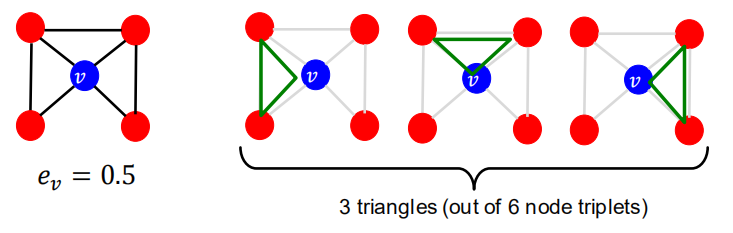

- 由图可以看出，集聚系数计算了自我网络中的三角形数量
- 因此我们可以通过计算预先指定的子图的数量（如graphlets）

- 目标:用于描述结点$u$周围的网络结构
  - Graphlets是描述结点$u$邻域网络结构的小子图

类比：
  - 度衡量了结点相邻的**边**的数量
  - 集聚系数衡量了结点相邻的**三角形**的数量
  - 异构子图度向量（Graphlet Degree Vector, GDV）：是结点基于异构子图的特征
    - GDV衡量了结点相邻的异构子图的数量

- 考虑一个大小为2~5个结点的异构子图，我们可以得到：
  - 73个坐标的向量即是一个描述结点邻域拓扑结构的签名

- 异构子图度向量是对结点局部网络拓扑结构的一种描述
  - 比较两个结点的向量提供了比结点的度或集聚系数更详细的局部拓扑相似性度量

##### 诱导子图和图同构
- 诱导子图（Induced subgraph）是另一种图，是由结点的子集以及连接该子集中所有结点的边构成。

- 图同构（Graph Isomorphism）是指两个图包含相同数量的结点并且以相同的方式进行连接，则称两个图为图同构

- Graphlets：root connected（根连接）
  - 5个结点最多可构成73种异构子图

- Graph Degree Vector(GDV)：根结点在特定位置模式下，统计子图数量对应的向量。

#### 结点级特征总结
- 本节介绍了不同的方式从而获得结点特征，分别为：
- 以重要性为基础的特征
  - 结点的度
  - 结点中心性的不同衡量方式
- 以结构为基础的特征
  - 结点的度
  - 集聚系数
  - 子图度向量

- 以重要性为基础的特征：衡量结点在图中的重要性
  - 结点的度
    - 简单统计某个结点相邻结点的数量
  - 结点中心性
    - 对图中某个结点相邻结点的重要性进行建模
    - 不同的衡量方法：特征向量中心性、中介中心性、接近中心性
- 用于预测图中有影响力的结点
  - 举例：预测社交网络中名人用户

- 以结构为基础的特征：捕获结点邻域的拓扑属性
  - 结点的度
    - 简单统计某个结点相邻结点的数量
  - 集聚系数
    - 度量相邻结点的连接情况
  - 子图度向量
    - 统计不同子图出现的次数
- 用于预测一个结点在图中的作用
  - 举例：在一个蛋白质-蛋白质相互作用网络中预测蛋白质功能

#### 讨论
对网络中不同结点进行打标的方式

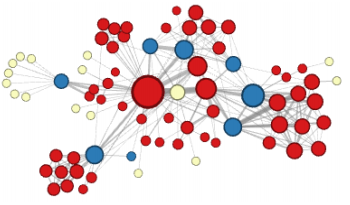
- 目前介绍的特征能够对上述结点进行区分

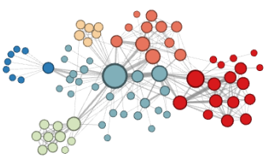
- 目前介绍的特征不能够对上述结点进行区分

#### 连接预测任务及其特征
#### 1. Link-level预测任务：Recap
- 该任务是通过已有的连接去预测是否存在新的连接
- 在测试阶段，不存在连接的结点对将会被排序，排名前K的结点对会被预测
- 该任务的核心是对**结点对**设计特征

#### 连接预测任务
连接预测任务的两种形式：
1. 连接随机丢失
   - 随机丢弃一部分连接，然后对他们进行预测

2. 连接随时间变化
   - 定义一段时间内的图$G[t_0, t_0']$，模型输出一个排好序的列表L，其中包含了在下一个时间段的图$G[t_1, t_1']$出现的连接
   - 如何评价
     - $n = |E_{new}|$：在时间段$[t_1, t_1']$出现的新的边
     - 取L中前n个元素，并统计预测对的边的数量

#### 通过邻近度进行连接预测
- 方法：
  - 对于结点对$(x, y)$并计算其分数$c(x, y)$
    - 例如，$c(x,y)$可能表示为$x$和$y$的共同邻居的数量
  - 根据$c(x,y)$递减的顺序对$(x,y)$进行排序
  - 将前n个结点对预测为存在新的连接
  - 并与$G[t_1, t_1']$时刻的图真实出现的连接进行比较

#### 连接级特征：概述
- Distance-based feature: 基于距离的特征
- Local neighborhood overlap：基于局部邻域重叠的特征
- Global neighborhood overlap：基于全局邻域重叠的特征

#### 1.基于距离的特征
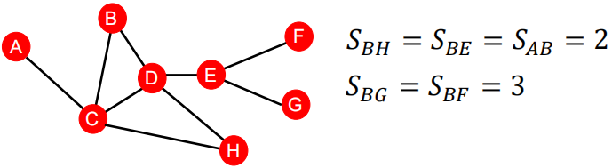

- 结点之间的最短路径
- 但是最短距不能反映出邻域的重叠程度
  - BH有两个公共结点，但是AB只有一个

#### 2.基于局部邻域重叠的特征
捕捉与结点$v_1$和$v_2$均相邻的结点数量
1. 共同邻接点数量：$|N(v_1) \cap N(v_2)|$
2. Jaccard系数:$\frac{|N(v_1) \cap N(v_2)|}{|N(v_1) \cup N(v_2)|}$
3. Adamic-Adar指数：$\sum_{u \in N(v_1) \cap N(v_2)} \frac{1}{log(k_u)}$ ,$k_c$表示结点c的度

- 局部邻域特征的局限性
  - 如果两个结点没有任务公共相邻结点，则这类特征总为0
  - 然而，这两个结点在未来也存在潜在的连接

- 全局邻域特征通过将整个图考虑进来，解决了这个局限性

#### 全局邻域重叠
- Katz 指数：两个结点之间所有不同长度路径的数量
- Q：如何计算两结点之间路径数量？
- A：使用图邻接矩阵的幂

#### 直觉：邻接矩阵的幂
- 计算两结点之间所有不同长度路径的数量
  - 回忆一下：$A_{uv} = 1$ if $u \in N(v)$
  - 定义$P_{uv}^{(K)}$为结点$u$和$v$之间长度为$K$的路径
  - 接下来将证明，$P^{(K)} = A^k$
  - $P_{uv}^{1}=A_{uv}$表示为路径长度为1的两个结点，即相邻结点

- 但是如何计算$P_{uv}^{(2)}$?
  - 步骤1：根据结点$u$的相邻结点和结点$v$,计算长度为1的路径的数量
  - 步骤2：将这些路径的数量和相加

#### 全局邻域重叠
- Katz index：统计两个结点之间所有长度行走次数的和

- 如何计算？
- 使用邻接矩阵的幂！
  - $A_{uv}$表示结点$u$和$v$之间行走次数为1的路径的数量（直接邻居）
  - $A_{uv}^2$表示结点$u$和$v$之间行走次数为2的路径的数量（邻居的邻居）
  - 类似，$A_{uv}^l$表示行走次数为l的路径的数量

- 结点$v_1$和$v_2$之间的Katz index计算方式如下：
  $$
  S_{v_1v_2}=\sum_{l=1}^{\infty}\beta^l A^l_{v_1v_2}
  $$
  - 计算所有长度行走次数对应的路径数量之和
  - $0 < \beta < 1$为衰减因子
  - $A_{v_1v_2}^l$表示结点$v_1$和$v_2$之间行走次数为l的路径的数量
- Katz index矩阵以闭式的形式进行计算：
  $$
  S = \sum_{i=1}^{\infty}\beta^i A^i = (\mathbf I -\beta A)^{-1} - \mathbf I
  $$

  简单推导（中间的字符需要整理替换）
  $$
  S=bA+b^2A^2+b^3A^3+\cdots = (I - bA)^{-1}-I
  $$
  $$
  (I-bA)(I+S)
  $$
  展开即可

#### Link-level特征：总结
- 基于距离的特征
  - 使用两个结点之间的最短路径长度，但是无法对邻域的重叠情况进行描述
- 局部邻域重叠
  - 衡量两个结点之间有多少共享结点
  - 当不存在共享结点时，总为0
- 全局邻域重叠
  - 使用全局图结构对两个节点进行打分
  - Katz index统计两个结点之间所有行走次数对应路径数量之和

#### Graph-level特征及核方法
#### Graph-level特征
- 目标：找到一些能表征整个图结构的特征

#### 背景：核方法
- 核方法在传统机器学习中常用来进行图预测
- 核心：设计核方法而不是特征向量
- 快速了解什么是核方法：
  - 核方法$K(G, G') \in \mathbb R$ 衡量数据之间的相似性
  - 核矩阵$\mathbf K=(K(G, G'))_{GG'}$必须总是半正定的
  - 存在一些特征表示$\phi(\cdot)$，使得$K(G,G')=\phi(G)^T \phi(G')$
  - 核方法一旦确定，就可以使用现成的机器学习模型进行预测（如核SVM）

#### Graph-level特征:概述
- Graph kernels：衡量两张图之间的相似性
  - Graphlet Kernel
  - Weisfeiler-Lehman Kernel
  - 其他的graph kernels
    - Random-walk kernel
    - Shorest-path kernel
    - And many more...

#### Graph kernel：关键思想
- 目的：设计图特征向量$\phi(G)$
- 核心思想：图的Bag-of-words(BoW，词袋模型)
  - BoW 忽略单词的排序，而只考虑单词计数作为文档的特征
  - 图的简单扩展：将结点看作是单词
  - 因为两张图都含有4个红色结点，因此两张不同的图我们得到了相同的特征向量

如果我们使用结点的度作为词袋呢？

- Graphlet Kernel和Weisfeiler-Lehman Kernel都是使用bag-of-\*来表征图，其中\*比结点的度更加复杂

#### Graph-level 子图特征
- 核心思想：统计图中不同子图的数量
  - 注意：这里子图的定义与node-level特征中子图的定义不太相同
  - 其中的差别为；
    - 此处子图的结点之间不需要有连接（允许存在孤立结点）
    - 子图可以没有根

定义$\mathcal G(g_1,g_2,\cdot, g_{n_k})$是一系列大小为k的子图

- 即给定图G，子图列表为$\mathcal G(g_1,g_2,\cdot, g_{n_k})$，定义子图计数向量$\mathbf f_G \in \mathcal R^{n_k}$为：
$$
(\mathbf f_G)_i = \text{number of } (g_i \subseteq G) \text{ for }i=1,2,\dots,n_k
$$

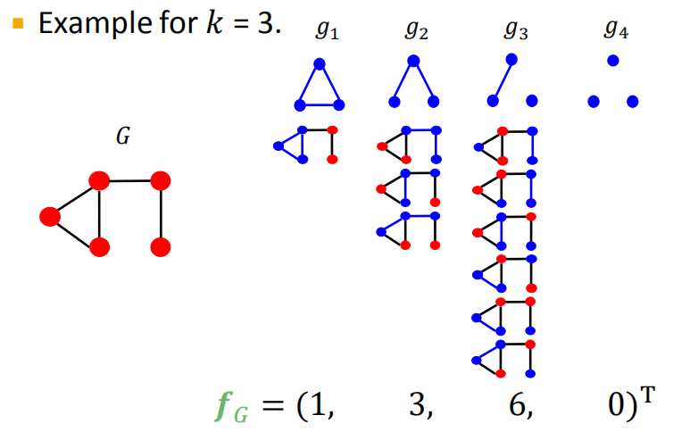

#### Graph-level Graphlet Kernel(图级别的子图核方法)
- 给定两个图，G和G‘,子图的核计算方式如下：
  $K(G,G')=f_G^Tf_G'$
- 问题：如果G和G’的尺寸大小不同，数值上将会产生不好的变动
- 解决方案：对每个特征向量进行归一化处理
$$
h_G = \frac{f_G}{sum(f_G)}
$$
$$
K(G,G')=h_G^Th_{G'}
$$

- 局限性：统计子图数量复杂度较高
  - 对于大小为$n$的图，统计大小为k的子图复杂度为$n^k$
  - 这在最差情况下难以接收，因为子图同构测试是一个NP-hard问题
  - 如果一个图结点的度都被限制在$d$以内，则存在一个复杂度为$O(nd^{k-1})$的算法来统计所有大小为$k$的子图个数

我们是否能够设计一个更加高效的核方法？

#### Weisfeiler-Lehman Kernel
- 目的：设计一个高效的图特征描述方法$\phi(G)$
- 思想：通过邻域结构来迭代的扩增结点“词包”
  - 是Bag of node degrees的扩展版本，由于结点的度是一跳邻域信息
- 使用的算法：颜色细化（color refinement）

#### Color refinement
- 给定，一个图$G$以及结点的集合$V$
  - 对每个结点$v$设定初始颜色$c^{(0)}(v)$
  - 通过如下方法迭代的细化结点的颜色
$$
c^{(k+1)}(v) = HASH(\{c^{(k)}(v), \{c^{(k)}(u)\}_{u\in N(v)}\})
$$
其中，HASH将不同的输入输入映射维不同的颜色
- 在颜色细化的第K步之后，$c^{(K)}(v)$描述了第K-跳邻域的结构

实例
- 设定初始结点颜色
  
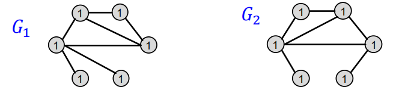

- 聚合邻域结点颜色
  
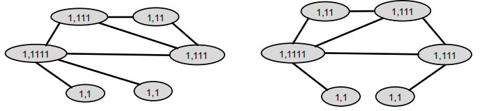

- HASH表颜色映射
  
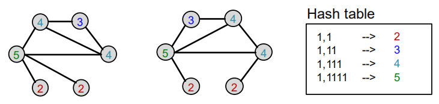

- 聚合邻域结点颜色

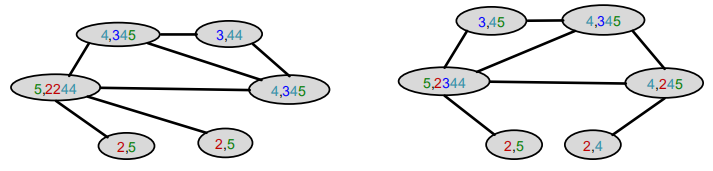

- HASH表颜色映射

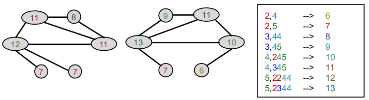

- 颜色细化之后，WL核方法计算特定颜色染过色的结点个数

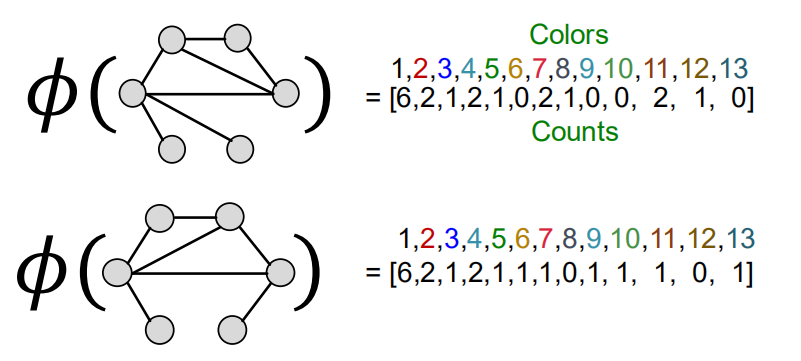

- WL核方法的值是通过计算颜色计数向量的内积得到的
$$
K(G, G') = \phi(G)^T\phi(G')=49
$$

#### Weisfeiler-Lehman Kernel
- WL核方法是计算高效的
  - 染色过程中每一步的时间复杂度与边的数量成线性关系，因为只聚合相邻结点的颜色
- 当计算核方法的值时，只有同时出现在两个图中的颜色才会被纳入计算
  - 因此，每种颜色的数量不超过图的结点数量
- 统计颜色的时间复杂度与结点数量呈线性关系
- 总时间复杂度与边的数量呈线性关系

#### Graph-level 特征：总结
- Graphlet Kernel
  - 图被表征为Bag-of-graphlets
  - 计算复杂度高
- Weisfeiler-Lehman Kernel
  - 使用k-跳颜色细化算法来扩增结点颜色“词袋”
    - 不同的颜色包含不同k-跳邻域结构信息
  - 图被表征为Bag-of-colors
  - 计算高效的
  - 与图神经网络很接近

#### 今日总结
- 传统机器学习pipeline
  - 手工特征 + 机器学习模型
- 图的手工特征
  - Node-level
    - 结点的度、中心性、聚集系数、异构子图
  - Link-level
    - 基于距离的特征
    - 局部/全局邻域重叠
  - Graph-level
    - Graphlet Kernel、WL Kernel
- 然而，我们只对图的结构进行特征化，并不是结点及其邻域的属性

