```python
# 导入工具包
import networkx as nx
import seaborn as sns

import pandas as pd
import numpy as np
import random

import matplotlib.pyplot as plt
%matplotlib inline

sns.set(style='white')
sns.set_palette(['#046586', '#28A9A1', '#C9A77C', '#F4A016', '#F6BBC6', '#E71F19'])  # Nature 配色
# %matplotlib inline
# %config InlineBackend.figure_format = 'svg'
plt.rcParams['figure.figsize'] = (5, 4)  # 2.24, 2.24 设置figure_size尺寸
plt.rcParams['savefig.dpi'] = 300  # 图片像素
plt.rcParams['figure.dpi'] = 100  # 分辨率
plt.rcParams['font.sans-serif'] = 'SimHei'  # 显示中文
# plt.rcParams['font.sans-serif'] = 'Times New Roman'  # 论文插图用
# 设置正常显示字符
plt.rcParams['axes.unicode_minus'] = False  #正常显示负号
# plt.rcParams['font.size'] = 60
```


# PageRank结点重要度


```python
G = nx.star_graph(7)
nx.draw(G, with_labels=True)
```


​    
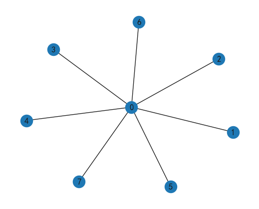
​    


#### 计算PageRank结点重要度


```python
pagerank = nx.pagerank(G, alpha=0.8)
pagerank
```


    {0: 0.4583348922684132,
     1: 0.07738072967594098,
     2: 0.07738072967594098,
     3: 0.07738072967594098,
     4: 0.07738072967594098,
     5: 0.07738072967594098,
     6: 0.07738072967594098,
     7: 0.07738072967594098}


# 结点连接数Node Degree度分析


#### 创建图


```python
# 创建 Erods-Renyi 随机图，也称作binomial graph
# n-节点数
# p-任意两个结点产生连接的概率

G = nx.gnp_random_graph(100, 0.02, seed=2023)
```


```python
# 初步可视化
pos = nx.spring_layout(G, seed=2023)
nx.draw(G, pos)
```


​    
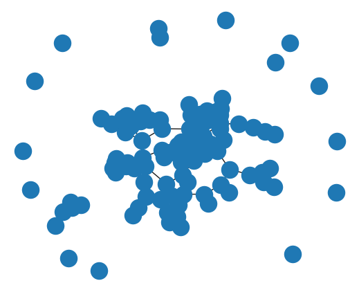
​    


# 最大连通域子图


```python
Gcc = G.subgraph(sorted(nx.connected_components(G), key=len, reverse=True)[0])
```


```python
pos = nx.spring_layout(Gcc, seed=2023)

nx.draw_networkx_nodes(Gcc, pos, node_size=20)
nx.draw_networkx_edges(Gcc, pos, alpha=0.4)
```


    <matplotlib.collections.LineCollection at 0x13bdd72d760>


​    
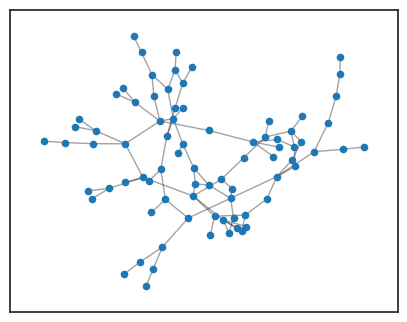
​    


```python
plt.figure(figsize=(12, 8))
pos = nx.spring_layout(Gcc, seed=2023)

# 设置其他可视化形式
options = {
    'font_size':12,
    'node_size':350,
    'node_color':'white',
    'edgecolors':'black',
    'linewidths':1,
    'width':2
}

nx.draw_networkx(Gcc, pos, **options)
plt.title('Connected components of G')
plt.axis('off')
plt.show()
```


​    
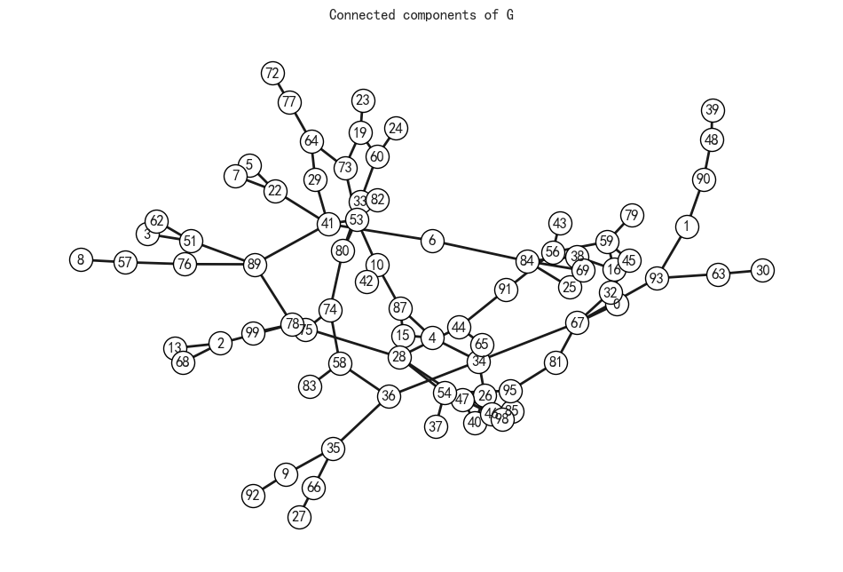
​    


#### 每个结点的连接数（degree）


```python
G.degree()
```


    DegreeView({0: 2, 1: 2, 2: 3, 3: 1, 4: 3, 5: 1, 6: 2, 7: 1, 8: 1, 9: 2, 10: 3, 11: 0, 12: 0, 13: 1, 14: 1, 15: 3, 16: 3, 17: 1, 18: 0, 19: 3, 20: 0, 21: 0, 22: 3, 23: 1, 24: 1, 25: 1, 26: 2, 27: 1, 28: 5, 29: 2, 30: 1, 31: 0, 32: 2, 33: 3, 34: 5, 35: 3, 36: 3, 37: 1, 38: 2, 39: 1, 40: 2, 41: 5, 42: 1, 43: 1, 44: 3, 45: 2, 46: 1, 47: 5, 48: 2, 49: 0, 50: 0, 51: 3, 52: 0, 53: 5, 54: 3, 55: 0, 56: 3, 57: 2, 58: 3, 59: 4, 60: 3, 61: 0, 62: 1, 63: 2, 64: 3, 65: 2, 66: 2, 67: 5, 68: 1, 69: 1, 70: 1, 71: 3, 72: 1, 73: 3, 74: 3, 75: 1, 76: 2, 77: 2, 78: 4, 79: 1, 80: 3, 81: 2, 82: 2, 83: 1, 84: 4, 85: 1, 86: 1, 87: 3, 88: 1, 89: 4, 90: 2, 91: 2, 92: 1, 93: 3, 94: 0, 95: 3, 96: 0, 97: 0, 98: 2, 99: 1})


```python
degree_sequence = sorted((d for n, d in G.degree()), reverse=True)
```


```python
degree_sequence
```


    [5,
     5,
     5,
     5,
     5,
     5,
     4,
     4,
     4,
     4,
     3,
     3,
     3,
     3,
     3,
     3,
     3,
     3,
     3,
     3,
     3,
     3,
     3,
     3,
     3,
     3,
     3,
     3,
     3,
     3,
     3,
     3,
     3,
     3,
     2,
     2,
     2,
     2,
     2,
     2,
     2,
     2,
     2,
     2,
     2,
     2,
     2,
     2,
     2,
     2,
     2,
     2,
     2,
     2,
     2,
     2,
     1,
     1,
     1,
     1,
     1,
     1,
     1,
     1,
     1,
     1,
     1,
     1,
     1,
     1,
     1,
     1,
     1,
     1,
     1,
     1,
     1,
     1,
     1,
     1,
     1,
     1,
     1,
     1,
     1,
     1,
     0,
     0,
     0,
     0,
     0,
     0,
     0,
     0,
     0,
     0,
     0,
     0,
     0,
     0]


```python
plt.figure(figsize=(12, 8))
plt.plot(degree_sequence, 'b-', marker='o')
plt.title('Degree Rank Plot', fontsize=20)
plt.ylabel('Degree', fontsize=25)
plt.ylabel('Rnak', fontsize=25)
plt.tick_params(labelsize=20)
plt.show()
```


​    

​    


#### 结点Degree直方图


```python
X = np.unique(degree_sequence, return_counts=True)[0]
Y = np.unique(degree_sequence, return_counts=True)[1]
```


```python
X
```


    array([0, 1, 2, 3, 4, 5])


```python
Y
```


    array([14, 30, 22, 24,  4,  6], dtype=int64)


```python
plt.figure(figsize=(12, 8))
plt.bar(X, Y)

plt.title('Degree Histogram', fontsize=20)
plt.ylabel('Number', fontsize=25)
plt.xlabel('Degree', fontsize=25)
plt.tick_params(labelsize=20)
plt.show()
```


​    
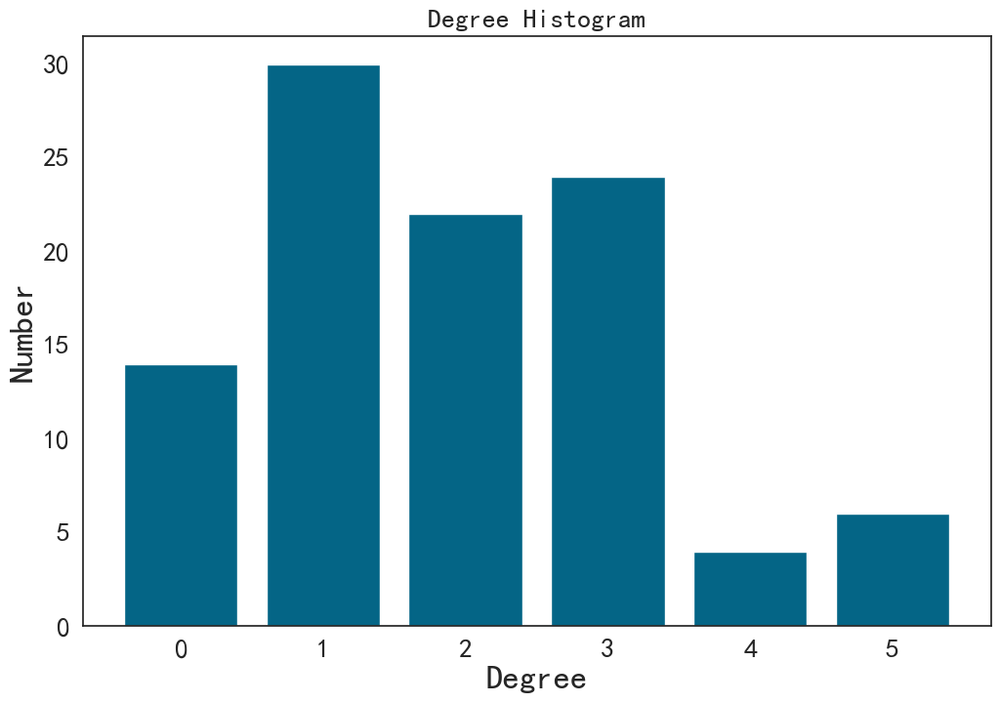
​    


## 棒棒糖图特征分析


### 导入图


```python
# 第一个参数指定头部结点数，第二个参数指定尾部结点数
G = nx.lollipop_graph(4, 7)
```


###  可视化


```python
pos = nx.spring_layout(G, seed=2023)
nx.draw(G, pos, with_labels=True)
```


​    

​    


#### 图数据分析


```python
# 半径
nx.radius(G)
```


    4


```python
# 直径
nx.diameter(G)
```


    8


```python
# 偏心度：每个结点到图中其他结点的最远距离
nx.eccentricity(G)
```


    {0: 8, 1: 8, 2: 8, 3: 7, 4: 6, 5: 5, 6: 4, 7: 5, 8: 6, 9: 7, 10: 8}


```python
# 中心结点，偏心度与半径相等的结点
nx.center(G)
```


    [6]


```python
# 外围结点，偏心度与直径相等的结点
nx.periphery(G)
```


    [0, 1, 2, 10]


```python
nx.density(G)
```


    0.23636363636363636


n为结点个数，m为连接个数
对于无向图：
$$
density = \frac{2m}{n(n-1)}
$$

对于有向图
$$
density = \frac{m}{n(n-1)}
$$
无连接图的density为0，全连接图的density为1，Multigraph（多重连接图）和带self loop的density可能大于1


### 3号结点到图中其他结点的最短距离


```python
node_id = 3
nx.single_source_shortest_path_length(G, node_id)
```


    {3: 0, 0: 1, 1: 1, 2: 1, 4: 1, 5: 2, 6: 3, 7: 4, 8: 5, 9: 6, 10: 7}


### 每两个结点之间的最短距离


```python
pathlength = []
for v in G.nodes():
    spl = nx.single_source_shortest_path_length(G, v)
    for p in spl:
        print(f'{v} --> {p}   最短距离 {spl[p]}')
        pathlength.append(spl[p])
```

    0 --> 0   最短距离 0
    0 --> 1   最短距离 1
    0 --> 2   最短距离 1
    0 --> 3   最短距离 1
    0 --> 4   最短距离 2
    0 --> 5   最短距离 3
    0 --> 6   最短距离 4
    0 --> 7   最短距离 5
    0 --> 8   最短距离 6
    0 --> 9   最短距离 7
    0 --> 10   最短距离 8
    1 --> 1   最短距离 0
    1 --> 0   最短距离 1
    1 --> 2   最短距离 1
    1 --> 3   最短距离 1
    1 --> 4   最短距离 2
    1 --> 5   最短距离 3
    1 --> 6   最短距离 4
    1 --> 7   最短距离 5
    1 --> 8   最短距离 6
    1 --> 9   最短距离 7
    1 --> 10   最短距离 8
    2 --> 2   最短距离 0
    2 --> 0   最短距离 1
    2 --> 1   最短距离 1
    2 --> 3   最短距离 1
    2 --> 4   最短距离 2
    2 --> 5   最短距离 3
    2 --> 6   最短距离 4
    2 --> 7   最短距离 5
    2 --> 8   最短距离 6
    2 --> 9   最短距离 7
    2 --> 10   最短距离 8
    3 --> 3   最短距离 0
    3 --> 0   最短距离 1
    3 --> 1   最短距离 1
    3 --> 2   最短距离 1
    3 --> 4   最短距离 1
    3 --> 5   最短距离 2
    3 --> 6   最短距离 3
    3 --> 7   最短距离 4
    3 --> 8   最短距离 5
    3 --> 9   最短距离 6
    3 --> 10   最短距离 7
    4 --> 4   最短距离 0
    4 --> 3   最短距离 1
    4 --> 5   最短距离 1
    4 --> 0   最短距离 2
    4 --> 1   最短距离 2
    4 --> 2   最短距离 2
    4 --> 6   最短距离 2
    4 --> 7   最短距离 3
    4 --> 8   最短距离 4
    4 --> 9   最短距离 5
    4 --> 10   最短距离 6
    5 --> 5   最短距离 0
    5 --> 4   最短距离 1
    5 --> 6   最短距离 1
    5 --> 3   最短距离 2
    5 --> 7   最短距离 2
    5 --> 0   最短距离 3
    5 --> 1   最短距离 3
    5 --> 2   最短距离 3
    5 --> 8   最短距离 3
    5 --> 9   最短距离 4
    5 --> 10   最短距离 5
    6 --> 6   最短距离 0
    6 --> 5   最短距离 1
    6 --> 7   最短距离 1
    6 --> 8   最短距离 2
    6 --> 4   最短距离 2
    6 --> 9   最短距离 3
    6 --> 3   最短距离 3
    6 --> 0   最短距离 4
    6 --> 1   最短距离 4
    6 --> 2   最短距离 4
    6 --> 10   最短距离 4
    7 --> 7   最短距离 0
    7 --> 8   最短距离 1
    7 --> 6   最短距离 1
    7 --> 9   最短距离 2
    7 --> 5   最短距离 2
    7 --> 10   最短距离 3
    7 --> 4   最短距离 3
    7 --> 3   最短距离 4
    7 --> 0   最短距离 5
    7 --> 1   最短距离 5
    7 --> 2   最短距离 5
    8 --> 8   最短距离 0
    8 --> 9   最短距离 1
    8 --> 7   最短距离 1
    8 --> 10   最短距离 2
    8 --> 6   最短距离 2
    8 --> 5   最短距离 3
    8 --> 4   最短距离 4
    8 --> 3   最短距离 5
    8 --> 0   最短距离 6
    8 --> 1   最短距离 6
    8 --> 2   最短距离 6
    9 --> 9   最短距离 0
    9 --> 8   最短距离 1
    9 --> 10   最短距离 1
    9 --> 7   最短距离 2
    9 --> 6   最短距离 3
    9 --> 5   最短距离 4
    9 --> 4   最短距离 5
    9 --> 3   最短距离 6
    9 --> 0   最短距离 7
    9 --> 1   最短距离 7
    9 --> 2   最短距离 7
    10 --> 10   最短距离 0
    10 --> 9   最短距离 1
    10 --> 8   最短距离 2
    10 --> 7   最短距离 3
    10 --> 6   最短距离 4
    10 --> 5   最短距离 5
    10 --> 4   最短距离 6
    10 --> 3   最短距离 7
    10 --> 0   最短距离 8
    10 --> 1   最短距离 8
    10 --> 2   最短距离 8


```python
#平均最短距离
sum(pathlength) / len(pathlength)
```


    3.2231404958677685


### 不同距离的结点对个数


```python
dist = {}
for p in pathlength:
    if p in dist:
        dist[p] += 1
    else:
        dist[p] = 1

dist
```


    {0: 11, 1: 26, 2: 18, 3: 16, 4: 14, 5: 12, 6: 10, 7: 8, 8: 6}


## 计算结点特征


```python
# 导入工具包
import networkx as nx
import matplotlib.pyplot as plt
import matplotlib.colors as mcolors
```


### 可视化辅助函数


```python
def draw(G, pos, measures, measure_name):
    nodes = nx.draw_networkx_nodes(G, pos, node_size=250, cmap=plt.cm.plasma,
                                   node_color=list(measures.values()),
                                   nodelist=measures.keys())
    
    nodes.set_norm(mcolors.SymLogNorm(linthresh=0.01, linscale=1, base=10))
    
    edges = nx.draw_networkx_edges(G, pos)
    
    plt.title(measure_name)
    plt.colorbar(nodes)
    plt.axis('off')
    plt.show()
```


### 导入无向图


```python
G = nx.karate_club_graph()
```


```python
pos = nx.spring_layout(G, seed=2023)
nx.draw(G, pos, with_labels=True)
```


​    
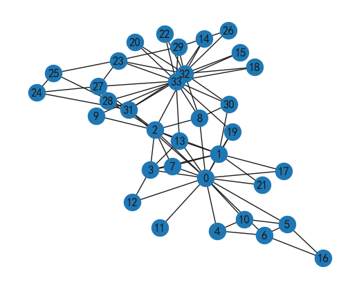
​    


### 导入有向图


```python
DiG = nx.DiGraph()
DiG.add_edges_from([(2, 3),(3, 2),(4, 1),(4, 2),(5, 2),(5, 4),
                    (5, 6),(6, 2),(6, 5),(7, 2),(7, 5),(8, 2),
                    (8, 5),(9, 2),(9, 5),(10, 5),(11, 5)])
nx.draw(DiG, pos, with_labels=True)
```


​    

​    


### Node degree


```python
list(nx.degree(G))
```


    [(0, 16),
     (1, 9),
     (2, 10),
     (3, 6),
     (4, 3),
     (5, 4),
     (6, 4),
     (7, 4),
     (8, 5),
     (9, 2),
     (10, 3),
     (11, 1),
     (12, 2),
     (13, 5),
     (14, 2),
     (15, 2),
     (16, 2),
     (17, 2),
     (18, 2),
     (19, 3),
     (20, 2),
     (21, 2),
     (22, 2),
     (23, 5),
     (24, 3),
     (25, 3),
     (26, 2),
     (27, 4),
     (28, 3),
     (29, 4),
     (30, 4),
     (31, 6),
     (32, 12),
     (33, 17)]


```python
dict(G.degree())
```


    {0: 16,
     1: 9,
     2: 10,
     3: 6,
     4: 3,
     5: 4,
     6: 4,
     7: 4,
     8: 5,
     9: 2,
     10: 3,
     11: 1,
     12: 2,
     13: 5,
     14: 2,
     15: 2,
     16: 2,
     17: 2,
     18: 2,
     19: 3,
     20: 2,
     21: 2,
     22: 2,
     23: 5,
     24: 3,
     25: 3,
     26: 2,
     27: 4,
     28: 3,
     29: 4,
     30: 4,
     31: 6,
     32: 12,
     33: 17}


```python
# 字典按值排序
sorted(dict(G.degree()).items(), key=lambda x: x[1], reverse=True)
```


    [(33, 17),
     (0, 16),
     (32, 12),
     (2, 10),
     (1, 9),
     (3, 6),
     (31, 6),
     (8, 5),
     (13, 5),
     (23, 5),
     (5, 4),
     (6, 4),
     (7, 4),
     (27, 4),
     (29, 4),
     (30, 4),
     (4, 3),
     (10, 3),
     (19, 3),
     (24, 3),
     (25, 3),
     (28, 3),
     (9, 2),
     (12, 2),
     (14, 2),
     (15, 2),
     (16, 2),
     (17, 2),
     (18, 2),
     (20, 2),
     (21, 2),
     (22, 2),
     (26, 2),
     (11, 1)]


```python
draw(G, pos, dict(G.degree()), 'Node Degree')
```


​    
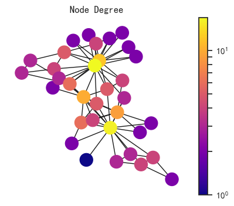
​    


#### Degree Centrality-无向图


```python
nx.degree_centrality(G)
```


    {0: 0.48484848484848486,
     1: 0.2727272727272727,
     2: 0.30303030303030304,
     3: 0.18181818181818182,
     4: 0.09090909090909091,
     5: 0.12121212121212122,
     6: 0.12121212121212122,
     7: 0.12121212121212122,
     8: 0.15151515151515152,
     9: 0.06060606060606061,
     10: 0.09090909090909091,
     11: 0.030303030303030304,
     12: 0.06060606060606061,
     13: 0.15151515151515152,
     14: 0.06060606060606061,
     15: 0.06060606060606061,
     16: 0.06060606060606061,
     17: 0.06060606060606061,
     18: 0.06060606060606061,
     19: 0.09090909090909091,
     20: 0.06060606060606061,
     21: 0.06060606060606061,
     22: 0.06060606060606061,
     23: 0.15151515151515152,
     24: 0.09090909090909091,
     25: 0.09090909090909091,
     26: 0.06060606060606061,
     27: 0.12121212121212122,
     28: 0.09090909090909091,
     29: 0.12121212121212122,
     30: 0.12121212121212122,
     31: 0.18181818181818182,
     32: 0.36363636363636365,
     33: 0.5151515151515151}


```python
draw(G, pos, nx.degree_centrality(G), 'Degree Centrality')
```

    Font 'default' does not have a glyph for '-' [U+2212], substituting with a dummy symbol.
    Font 'default' does not have a glyph for '-' [U+2212], substituting with a dummy symbol.
    Font 'default' does not have a glyph for '-' [U+2212], substituting with a dummy symbol.
    Font 'default' does not have a glyph for '-' [U+2212], substituting with a dummy symbol.


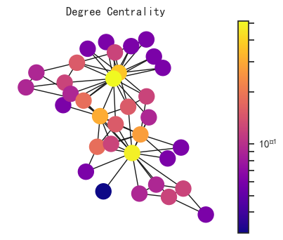
    


#### Degree Centrality-有向图


```python
nx.in_degree_centrality(DiG)
```


    {2: 0.7000000000000001,
     3: 0.1,
     4: 0.1,
     1: 0.1,
     5: 0.6000000000000001,
     6: 0.1,
     7: 0.0,
     8: 0.0,
     9: 0.0,
     10: 0.0,
     11: 0.0}


```python
nx.out_degree_centrality(DiG)
```


    {2: 0.1,
     3: 0.1,
     4: 0.2,
     1: 0.0,
     5: 0.30000000000000004,
     6: 0.2,
     7: 0.2,
     8: 0.2,
     9: 0.2,
     10: 0.1,
     11: 0.1}


```python
draw(DiG, pos, nx.in_degree_centrality(DiG), 'DiGraph Degree Centrality')
```

    Font 'default' does not have a glyph for '-' [U+2212], substituting with a dummy symbol.
    Font 'default' does not have a glyph for '-' [U+2212], substituting with a dummy symbol.
    Font 'default' does not have a glyph for '-' [U+2212], substituting with a dummy symbol.
    Font 'default' does not have a glyph for '-' [U+2212], substituting with a dummy symbol.
    Font 'default' does not have a glyph for '-' [U+2212], substituting with a dummy symbol.
    Font 'default' does not have a glyph for '-' [U+2212], substituting with a dummy symbol.
    Font 'default' does not have a glyph for '-' [U+2212], substituting with a dummy symbol.
    Font 'default' does not have a glyph for '-' [U+2212], substituting with a dummy symbol.


    


```python
draw(DiG, pos, nx.out_degree_centrality(DiG), 'DiGraph Degree Centrality')
```

    Font 'default' does not have a glyph for '-' [U+2212], substituting with a dummy symbol.
    Font 'default' does not have a glyph for '-' [U+2212], substituting with a dummy symbol.
    Font 'default' does not have a glyph for '-' [U+2212], substituting with a dummy symbol.
    Font 'default' does not have a glyph for '-' [U+2212], substituting with a dummy symbol.
    Font 'default' does not have a glyph for '-' [U+2212], substituting with a dummy symbol.
    Font 'default' does not have a glyph for '-' [U+2212], substituting with a dummy symbol.
    Font 'default' does not have a glyph for '-' [U+2212], substituting with a dummy symbol.
    Font 'default' does not have a glyph for '-' [U+2212], substituting with a dummy symbol.


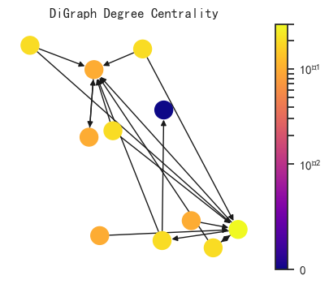
    


#### Eigenvector Centrality-无向图


```python
draw(G, pos, nx.eigenvector_centrality(G), 'Eigenvector Centrality')
```

    Font 'default' does not have a glyph for '-' [U+2212], substituting with a dummy symbol.
    Font 'default' does not have a glyph for '-' [U+2212], substituting with a dummy symbol.
    Font 'default' does not have a glyph for '-' [U+2212], substituting with a dummy symbol.
    Font 'default' does not have a glyph for '-' [U+2212], substituting with a dummy symbol.


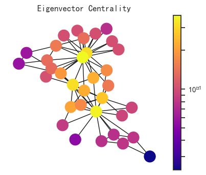
    


#### Eigenvector Centrality-有向图


```python
draw(DiG, pos, nx.eigenvector_centrality_numpy(DiG), 'Eigenvector Centrality')
```

    Font 'default' does not have a glyph for '-' [U+2212], substituting with a dummy symbol.
    Font 'default' does not have a glyph for '-' [U+2212], substituting with a dummy symbol.
    Font 'default' does not have a glyph for '-' [U+2212], substituting with a dummy symbol.
    Font 'default' does not have a glyph for '-' [U+2212], substituting with a dummy symbol.
    Font 'default' does not have a glyph for '-' [U+2212], substituting with a dummy symbol.
    Font 'default' does not have a glyph for '-' [U+2212], substituting with a dummy symbol.
    Font 'default' does not have a glyph for '-' [U+2212], substituting with a dummy symbol.
    Font 'default' does not have a glyph for '-' [U+2212], substituting with a dummy symbol.


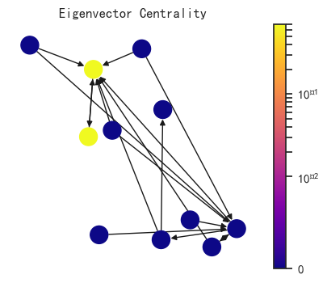
    


#### Betweeness Centrality (必经之地)


```python
nx.betweenness_centrality(G)
```


    {0: 0.43763528138528146,
     1: 0.053936688311688304,
     2: 0.14365680615680618,
     3: 0.011909271284271283,
     4: 0.0006313131313131313,
     5: 0.02998737373737374,
     6: 0.029987373737373736,
     7: 0.0,
     8: 0.05592682780182781,
     9: 0.0008477633477633478,
     10: 0.0006313131313131313,
     11: 0.0,
     12: 0.0,
     13: 0.04586339586339586,
     14: 0.0,
     15: 0.0,
     16: 0.0,
     17: 0.0,
     18: 0.0,
     19: 0.03247504810004811,
     20: 0.0,
     21: 0.0,
     22: 0.0,
     23: 0.017613636363636363,
     24: 0.0022095959595959595,
     25: 0.0038404882154882154,
     26: 0.0,
     27: 0.02233345358345358,
     28: 0.0017947330447330447,
     29: 0.0029220779220779218,
     30: 0.014411976911976909,
     31: 0.13827561327561325,
     32: 0.145247113997114,
     33: 0.30407497594997596}


```python
draw(G, pos, nx.betweenness_centrality(G), 'Betweeness Centrality')
```

    Font 'default' does not have a glyph for '-' [U+2212], substituting with a dummy symbol.
    Font 'default' does not have a glyph for '-' [U+2212], substituting with a dummy symbol.
    Font 'default' does not have a glyph for '-' [U+2212], substituting with a dummy symbol.
    Font 'default' does not have a glyph for '-' [U+2212], substituting with a dummy symbol.
    Font 'default' does not have a glyph for '-' [U+2212], substituting with a dummy symbol.
    Font 'default' does not have a glyph for '-' [U+2212], substituting with a dummy symbol.
    Font 'default' does not have a glyph for '-' [U+2212], substituting with a dummy symbol.
    Font 'default' does not have a glyph for '-' [U+2212], substituting with a dummy symbol.


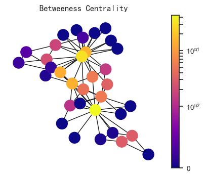
    


#### Closeness Centrality (去哪都近)


```python
nx.closeness_centrality(G)
```


    {0: 0.5689655172413793,
     1: 0.4852941176470588,
     2: 0.559322033898305,
     3: 0.4647887323943662,
     4: 0.3793103448275862,
     5: 0.38372093023255816,
     6: 0.38372093023255816,
     7: 0.44,
     8: 0.515625,
     9: 0.4342105263157895,
     10: 0.3793103448275862,
     11: 0.36666666666666664,
     12: 0.3707865168539326,
     13: 0.515625,
     14: 0.3707865168539326,
     15: 0.3707865168539326,
     16: 0.28448275862068967,
     17: 0.375,
     18: 0.3707865168539326,
     19: 0.5,
     20: 0.3707865168539326,
     21: 0.375,
     22: 0.3707865168539326,
     23: 0.39285714285714285,
     24: 0.375,
     25: 0.375,
     26: 0.3626373626373626,
     27: 0.4583333333333333,
     28: 0.4520547945205479,
     29: 0.38372093023255816,
     30: 0.4583333333333333,
     31: 0.5409836065573771,
     32: 0.515625,
     33: 0.55}


```python
draw(G, pos, nx.closeness_centrality(G), 'Closeness Centrality')
```

    Font 'default' does not have a glyph for '-' [U+2212], substituting with a dummy symbol.
    Font 'default' does not have a glyph for '-' [U+2212], substituting with a dummy symbol.
    Font 'default' does not have a glyph for '-' [U+2212], substituting with a dummy symbol.
    Font 'default' does not have a glyph for '-' [U+2212], substituting with a dummy symbol.
    Font 'default' does not have a glyph for '-' [U+2212], substituting with a dummy symbol.
    Font 'default' does not have a glyph for '-' [U+2212], substituting with a dummy symbol.
    Font 'default' does not have a glyph for '-' [U+2212], substituting with a dummy symbol.
    Font 'default' does not have a glyph for '-' [U+2212], substituting with a dummy symbol.
    Font 'default' does not have a glyph for '-' [U+2212], substituting with a dummy symbol.
    Font 'default' does not have a glyph for '-' [U+2212], substituting with a dummy symbol.
    Font 'default' does not have a glyph for '-' [U+2212], substituting with a dummy symbol.
    Font 'default' does not have a glyph for '-' [U+2212], substituting with a dummy symbol.


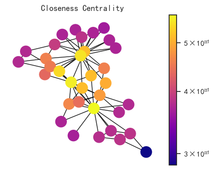
    


### PageRank


```python
nx.pagerank(DiG, alpha=0.8)
```


    {2: 0.35498362527288035,
     3: 0.3050906960724587,
     4: 0.04755306418089125,
     1: 0.04012092964665928,
     5: 0.09920010077470663,
     6: 0.04755306418089125,
     7: 0.021099703974302532,
     8: 0.021099703974302532,
     9: 0.021099703974302532,
     10: 0.021099703974302532,
     11: 0.021099703974302532}


```python
draw(DiG, pos, nx.pagerank(DiG, alpha=0.85), 'DiGraph PageRank')
```

    Font 'default' does not have a glyph for '-' [U+2212], substituting with a dummy symbol.
    Font 'default' does not have a glyph for '-' [U+2212], substituting with a dummy symbol.
    Font 'default' does not have a glyph for '-' [U+2212], substituting with a dummy symbol.
    Font 'default' does not have a glyph for '-' [U+2212], substituting with a dummy symbol.


    


### Katz Centrality


```python
draw(G, pos, nx.katz_centrality(G, alpha=0.1, beta=1.0), 'G Katz Centrality')
```

    Font 'default' does not have a glyph for '-' [U+2212], substituting with a dummy symbol.
    Font 'default' does not have a glyph for '-' [U+2212], substituting with a dummy symbol.
    Font 'default' does not have a glyph for '-' [U+2212], substituting with a dummy symbol.
    Font 'default' does not have a glyph for '-' [U+2212], substituting with a dummy symbol.
    Font 'default' does not have a glyph for '-' [U+2212], substituting with a dummy symbol.
    Font 'default' does not have a glyph for '-' [U+2212], substituting with a dummy symbol.
    Font 'default' does not have a glyph for '-' [U+2212], substituting with a dummy symbol.
    Font 'default' does not have a glyph for '-' [U+2212], substituting with a dummy symbol.
    Font 'default' does not have a glyph for '-' [U+2212], substituting with a dummy symbol.
    Font 'default' does not have a glyph for '-' [U+2212], substituting with a dummy symbol.
    Font 'default' does not have a glyph for '-' [U+2212], substituting with a dummy symbol.
    Font 'default' does not have a glyph for '-' [U+2212], substituting with a dummy symbol.


    


```python
draw(DiG, pos, nx.katz_centrality(DiG, alpha=0.1, beta=1.0), 'DiG Katz Centrality')
```

    Font 'default' does not have a glyph for '-' [U+2212], substituting with a dummy symbol.
    Font 'default' does not have a glyph for '-' [U+2212], substituting with a dummy symbol.
    Font 'default' does not have a glyph for '-' [U+2212], substituting with a dummy symbol.
    Font 'default' does not have a glyph for '-' [U+2212], substituting with a dummy symbol.
    Font 'default' does not have a glyph for '-' [U+2212], substituting with a dummy symbol.
    Font 'default' does not have a glyph for '-' [U+2212], substituting with a dummy symbol.
    Font 'default' does not have a glyph for '-' [U+2212], substituting with a dummy symbol.
    Font 'default' does not have a glyph for '-' [U+2212], substituting with a dummy symbol.


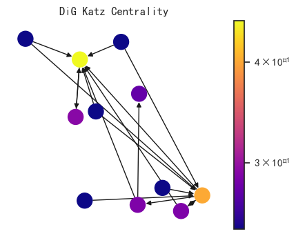
    


### HITS Hubs and Authorities


```python
h, a = nx.hits(DiG)
draw(DiG, pos, h, 'DiG HITS Hubs')
draw(DiG, pos, a, 'DiG HITS Authorities')
```

    Font 'default' does not have a glyph for '-' [U+2212], substituting with a dummy symbol.
    Font 'default' does not have a glyph for '-' [U+2212], substituting with a dummy symbol.
    Font 'default' does not have a glyph for '-' [U+2212], substituting with a dummy symbol.
    Font 'default' does not have a glyph for '-' [U+2212], substituting with a dummy symbol.
    Font 'default' does not have a glyph for '-' [U+2212], substituting with a dummy symbol.
    Font 'default' does not have a glyph for '-' [U+2212], substituting with a dummy symbol.
    Font 'default' does not have a glyph for '-' [U+2212], substituting with a dummy symbol.
    Font 'default' does not have a glyph for '-' [U+2212], substituting with a dummy symbol.


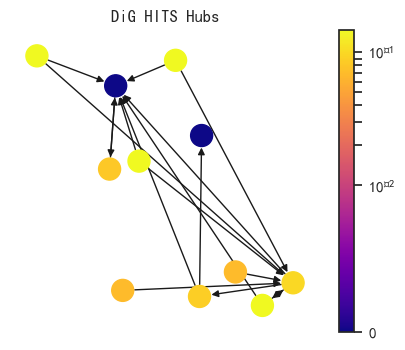
    


    Font 'default' does not have a glyph for '-' [U+2212], substituting with a dummy symbol.
    Font 'default' does not have a glyph for '-' [U+2212], substituting with a dummy symbol.
    Font 'default' does not have a glyph for '-' [U+2212], substituting with a dummy symbol.
    Font 'default' does not have a glyph for '-' [U+2212], substituting with a dummy symbol.
    Font 'default' does not have a glyph for '-' [U+2212], substituting with a dummy symbol.
    Font 'default' does not have a glyph for '-' [U+2212], substituting with a dummy symbol.
    Font 'default' does not have a glyph for '-' [U+2212], substituting with a dummy symbol.
    Font 'default' does not have a glyph for '-' [U+2212], substituting with a dummy symbol.


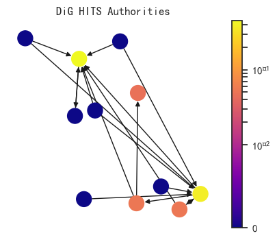
    


#### NetworkX 社群属性


```python
nx.draw(G, pos, with_labels=True)
```


​    

​    


#### 三角形个数


```python
nx.triangles(G)
```


    {0: 18,
     1: 12,
     2: 11,
     3: 10,
     4: 2,
     5: 3,
     6: 3,
     7: 6,
     8: 5,
     9: 0,
     10: 2,
     11: 0,
     12: 1,
     13: 6,
     14: 1,
     15: 1,
     16: 1,
     17: 1,
     18: 1,
     19: 1,
     20: 1,
     21: 1,
     22: 1,
     23: 4,
     24: 1,
     25: 1,
     26: 1,
     27: 1,
     28: 1,
     29: 4,
     30: 3,
     31: 3,
     32: 13,
     33: 15}


```python
draw(G, pos, nx.triangles(G), 'Triangles')
```

    Font 'default' does not have a glyph for '-' [U+2212], substituting with a dummy symbol.
    Font 'default' does not have a glyph for '-' [U+2212], substituting with a dummy symbol.
    Font 'default' does not have a glyph for '-' [U+2212], substituting with a dummy symbol.
    Font 'default' does not have a glyph for '-' [U+2212], substituting with a dummy symbol.
    Font 'default' does not have a glyph for '-' [U+2212], substituting with a dummy symbol.
    Font 'default' does not have a glyph for '-' [U+2212], substituting with a dummy symbol.
    Font 'default' does not have a glyph for '-' [U+2212], substituting with a dummy symbol.
    Font 'default' does not have a glyph for '-' [U+2212], substituting with a dummy symbol.


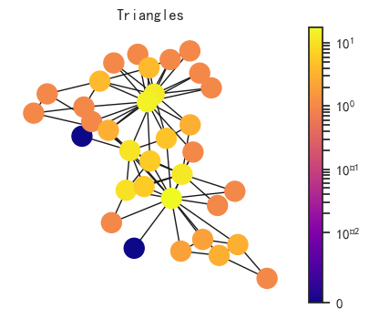
    


#### Clustering Coefficient


```python
nx.clustering(G)
```


    {0: 0.15,
     1: 0.3333333333333333,
     2: 0.24444444444444444,
     3: 0.6666666666666666,
     4: 0.6666666666666666,
     5: 0.5,
     6: 0.5,
     7: 1.0,
     8: 0.5,
     9: 0,
     10: 0.6666666666666666,
     11: 0,
     12: 1.0,
     13: 0.6,
     14: 1.0,
     15: 1.0,
     16: 1.0,
     17: 1.0,
     18: 1.0,
     19: 0.3333333333333333,
     20: 1.0,
     21: 1.0,
     22: 1.0,
     23: 0.4,
     24: 0.3333333333333333,
     25: 0.3333333333333333,
     26: 1.0,
     27: 0.16666666666666666,
     28: 0.3333333333333333,
     29: 0.6666666666666666,
     30: 0.5,
     31: 0.2,
     32: 0.19696969696969696,
     33: 0.11029411764705882}


```python
draw(G, pos, nx.clustering(G), 'Clustering Coefficients')
```

    Font 'default' does not have a glyph for '-' [U+2212], substituting with a dummy symbol.
    Font 'default' does not have a glyph for '-' [U+2212], substituting with a dummy symbol.
    Font 'default' does not have a glyph for '-' [U+2212], substituting with a dummy symbol.
    Font 'default' does not have a glyph for '-' [U+2212], substituting with a dummy symbol.
    Font 'default' does not have a glyph for '-' [U+2212], substituting with a dummy symbol.
    Font 'default' does not have a glyph for '-' [U+2212], substituting with a dummy symbol.
    Font 'default' does not have a glyph for '-' [U+2212], substituting with a dummy symbol.
    Font 'default' does not have a glyph for '-' [U+2212], substituting with a dummy symbol.


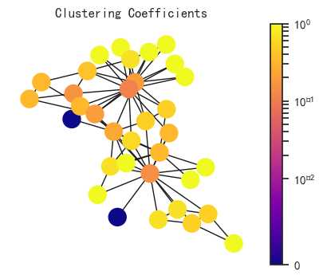
    


#### Bridges
如果某个连接断掉，会使连通域个数增加，则该连接是bridg

bridge不属于环的一部分


```python
pos = nx.spring_layout(G, seed=675)
nx.draw(G, pos, with_labels=True)
```


​    

​    


```python
list(nx.bridges(G))
```


    [(0, 11)]


#### Common Neighbors 和 Jaccard Coefficient


```python
sorted(nx.common_neighbors(G, 0, 4))
```


    [6, 10]


```python
preds = nx.jaccard_coefficient(G, [(0, 1), (2, 3)])
for u, v, p in preds:
    print(f'({u}, {v}) -> {p:.8f}')
```

    (0, 1) -> 0.38888889
    (2, 3) -> 0.33333333


```python
preds = nx.adamic_adar_index(G, [(0, 1), (2, 3)])
for u, v, p in preds:
    print(f'({u}, {v}) -> {p:.8f}')
```

    (0, 1) -> 6.13071687
    (2, 3) -> 2.15847583


#### Katz Index
结点u到结点v，路径为k的路径个数


```python
import networkx as nx
import numpy as np
from numpy.linalg import inv

G = nx.karate_club_graph()
```


```python
len(G.nodes())
```


    34


```python
# 计算主特征向量
L = nx.normalized_laplacian_matrix(G)
e = np.linalg.eigvals(L.A)
print(f'最大特征值', max(e))

# 折减系数
beta = 1/max(e)

# 创建单位矩阵
I = np.identity(len(G.nodes()))

# 计算Katz index
S = inv(I - nx.to_numpy_array(G) * beta) - I
```

    最大特征值 1.7146113474736127


```python
S.shape
```


    (34, 34)


```python
S
```


    array([[-0.630971  ,  0.03760311, -0.50718655, ...,  0.22028562,
             0.08051109,  0.0187629 ],
           [ 0.03760311,  0.0313979 , -1.09231501, ...,  0.18920621,
            -0.09098329,  0.08188737],
           [-0.50718655, -1.09231501,  0.79993439, ..., -0.4511988 ,
             0.17631358, -0.23914987],
           ...,
           [ 0.22028562,  0.18920621, -0.4511988 , ..., -0.07349891,
             0.47525815, -0.0457034 ],
           [ 0.08051109, -0.09098329,  0.17631358, ...,  0.47525815,
            -0.28781332, -0.70104834],
           [ 0.0187629 ,  0.08188737, -0.23914987, ..., -0.0457034 ,
            -0.70104834, -0.50717615]])


## 北京上海地铁站图数据挖掘


#### 定义可视化辅助函数


```python
def draw(G, pos, measures, measure_name):
    nodes = nx.draw_networkx_nodes(G, pos, node_size=250, cmap=plt.cm.plasma,
                                   node_color=list(measures.values()),
                                   nodelist=measures.keys())
    
    nodes.set_norm(mcolors.SymLogNorm(linthresh=0.01, linscale=1, base=10))
    
    edges = nx.draw_networkx_edges(G, pos)
    
    plt.title(measure_name)
    plt.colorbar(nodes)
    plt.axis('off')
    plt.show()
```


#### 字典按值排序辅助函数


```python
def dict_sort_by_value(dict_input):
    """
    输入字典，输出按值排序的字典 
    """
    return sorted(dict_input.items(), key=lambda x: x[1], reverse=True)
```


#### 导入地铁站连接表


```python
# 上海地铁站连接表
import pandas as pd
df = pd.read_csv(r'./data/shanghai_subway.csv')
```


```python
df
```


<div>
<style scoped>
    .dataframe tbody tr th:only-of-type {
        vertical-align: middle;
    }

    .dataframe tbody tr th {
        vertical-align: top;
    }
    
    .dataframe thead th {
        text-align: right;
    }
</style>
<table border="1" class="dataframe">
  <thead>
    <tr style="text-align: right;">
      <th></th>
      <th>前一站</th>
      <th>后一站</th>
      <th>地铁线</th>
      <th>时间（分钟）</th>
    </tr>
  </thead>
  <tbody>
    <tr>
      <th>0</th>
      <td>莘庄</td>
      <td>外环路</td>
      <td>1</td>
      <td>2</td>
    </tr>
    <tr>
      <th>1</th>
      <td>外环路</td>
      <td>莲花路</td>
      <td>1</td>
      <td>2</td>
    </tr>
    <tr>
      <th>2</th>
      <td>莲花路</td>
      <td>锦江乐园</td>
      <td>1</td>
      <td>3</td>
    </tr>
    <tr>
      <th>3</th>
      <td>锦江乐园</td>
      <td>上海南站</td>
      <td>1</td>
      <td>3</td>
    </tr>
    <tr>
      <th>4</th>
      <td>上海南站</td>
      <td>漕宝路</td>
      <td>1</td>
      <td>3</td>
    </tr>
    <tr>
      <th>...</th>
      <td>...</td>
      <td>...</td>
      <td>...</td>
      <td>...</td>
    </tr>
    <tr>
      <th>487</th>
      <td>抚顺路</td>
      <td>国权路</td>
      <td>18</td>
      <td>2</td>
    </tr>
    <tr>
      <th>488</th>
      <td>国权路</td>
      <td>复旦大学</td>
      <td>18</td>
      <td>3</td>
    </tr>
    <tr>
      <th>489</th>
      <td>复旦大学</td>
      <td>上海财经大学</td>
      <td>18</td>
      <td>2</td>
    </tr>
    <tr>
      <th>490</th>
      <td>上海财经大学</td>
      <td>殷高路</td>
      <td>18</td>
      <td>2</td>
    </tr>
    <tr>
      <th>491</th>
      <td>殷高路</td>
      <td>长江南路</td>
      <td>18</td>
      <td>2</td>
    </tr>
  </tbody>
</table>
<p>492 rows × 4 columns</p>
</div>


#### 创建图


#### 创建无向图


```python
G = nx.Graph()
```

#### 从连接表创建图


```python
for idx, row in df.iterrows():
    G.add_edges_from([(row['前一站'], row['后一站'])], line=row['地铁线'], time=row['时间（分钟）'])
```


#### 检查是否导入成功


```python
# 节点个数
G.number_of_nodes()
```


    402


```python
# 连接个数
G.number_of_edges()
```


    480


```python
# 查看连接特征
G.edges[('同济大学', '四平路')]
```


    {'line': 10, 'time': 2}


#### 可视化


```python
# j结点排版布局，默认弹簧布局
pos = nx.spring_layout(G, seed=123)
plt.figure(figsize=(15, 15))
nx.draw(G, pos)
```


​    

​    


#### shorest path 最短路径


```python
# 任意两节点之间是否存在路径
nx.has_path(G, source='昌吉东路', target='同济大学')
```


    True


```python
# 任意两结点之间的最短路径
nx.shortest_path(G, source='昌吉东路', target='同济大学', weight='time')
```


    ['昌吉东路',
     '上海赛车场',
     '嘉定新城',
     '马陆',
     '陈翔公路',
     '南翔',
     '桃浦新村',
     '武威路',
     '祁连山路',
     '李子园',
     '上海西站',
     '真如',
     '枫桥路',
     '曹杨路',
     '镇坪路',
     '中潭路',
     '上海火车站',
     '宝山路',
     '海伦路',
     '邮电新村',
     '四平路',
     '同济大学']


```python
# 任意两结点之间的最短路径
nx.shortest_path_length(G, source='昌吉东路', target='同济大学', weight='time')
```


    59


```python
# 全图平均最短路径
nx.average_shortest_path_length(G, weight='time')
```


    41.06494956638255


```python
# 某一站去其他站的最短路径
# nx.single_source_shortest_path(G, source='同济大学')

# # 某一站去其他站的最短路径长度
# nx.single_source_shortest_path_length(G, source='同济大学')
```


## 地铁导航系统


```python
# 指定起始站和终点站
A_station = '昌吉东路'
B_station = '同济大学'

# 获取最短路径
shorest_path_list = nx.shortest_path(G, source=A_station, target=B_station, weight='time')

for i in range(len(shorest_path_list) - 1):
    previous_station = shorest_path_list[i]
    next_station = shorest_path_list[i + 1]
    line_id = G.edges[(previous_station, next_station)]['line']
    time = G.edges[(previous_station, next_station)]['time']
    print(f'{previous_station} -> {next_station}  {line_id}号线  {time}分钟')
```

    昌吉东路 -> 上海赛车场  11号线  4分钟
    上海赛车场 -> 嘉定新城  11号线  4分钟
    嘉定新城 -> 马陆  11号线  3分钟
    马陆 -> 陈翔公路  11号线  4分钟
    陈翔公路 -> 南翔  11号线  3分钟
    南翔 -> 桃浦新村  11号线  3分钟
    桃浦新村 -> 武威路  11号线  3分钟
    武威路 -> 祁连山路  11号线  2分钟
    祁连山路 -> 李子园  11号线  3分钟
    李子园 -> 上海西站  11号线  2分钟
    上海西站 -> 真如  11号线  3分钟
    真如 -> 枫桥路  11号线  2分钟
    枫桥路 -> 曹杨路  11号线  2分钟
    曹杨路 -> 镇坪路  4号线  3分钟
    镇坪路 -> 中潭路  4号线  2分钟
    中潭路 -> 上海火车站  4号线  3分钟
    上海火车站 -> 宝山路  4号线  4分钟
    宝山路 -> 海伦路  4号线  3分钟
    海伦路 -> 邮电新村  10号线  2分钟
    邮电新村 -> 四平路  10号线  2分钟
    四平路 -> 同济大学  10号线  2分钟


### Node Degree


```python
# dict_sort_by_value(dict(G.degree()))
```


```python
plt.figure(figsize=(15, 10))
draw(G, pos, dict(G.degree()), 'Node Degree')
```


​    
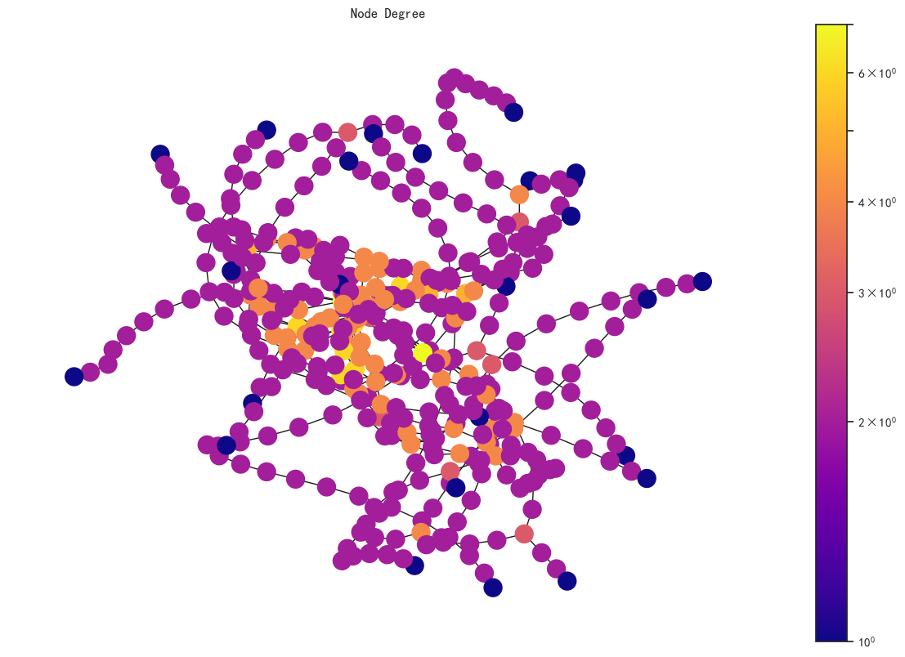
​    


```python
plt.figure(figsize=(15, 10))
draw(G, pos, nx.degree_centrality(G), 'Degree centrality')
```

    Font 'default' does not have a glyph for '-' [U+2212], substituting with a dummy symbol.
    Font 'default' does not have a glyph for '-' [U+2212], substituting with a dummy symbol.
    Font 'default' does not have a glyph for '-' [U+2212], substituting with a dummy symbol.
    Font 'default' does not have a glyph for '-' [U+2212], substituting with a dummy symbol.


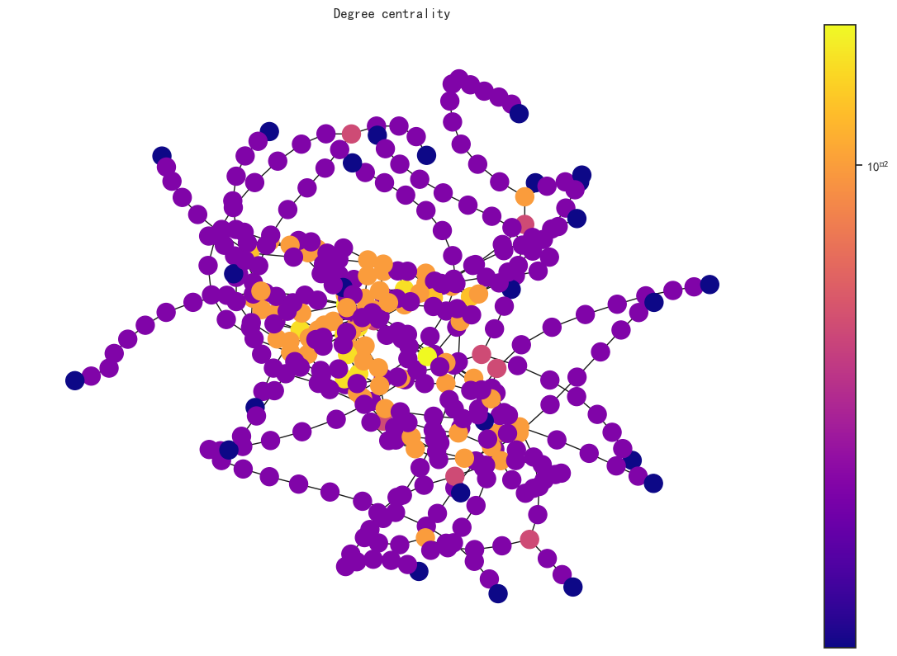
    


### Eigenvector Centrality (可能不收敛)


```python
# nx.eigenvector_centrality(G)
```


```python
plt.figure(figsize=(15, 10))
draw(G, pos, nx.eigenvector_centrality(G), 'Eigenvector centrality')
```

    Font 'default' does not have a glyph for '-' [U+2212], substituting with a dummy symbol.
    Font 'default' does not have a glyph for '-' [U+2212], substituting with a dummy symbol.
    Font 'default' does not have a glyph for '-' [U+2212], substituting with a dummy symbol.
    Font 'default' does not have a glyph for '-' [U+2212], substituting with a dummy symbol.
    Font 'default' does not have a glyph for '-' [U+2212], substituting with a dummy symbol.
    Font 'default' does not have a glyph for '-' [U+2212], substituting with a dummy symbol.
    Font 'default' does not have a glyph for '-' [U+2212], substituting with a dummy symbol.
    Font 'default' does not have a glyph for '-' [U+2212], substituting with a dummy symbol.


    


### Closeness centrality (去哪都近)


```python
plt.figure(figsize=(15, 10))
draw(G, pos, nx.closeness_centrality(G), 'Closeness Centrality')
```

    Font 'default' does not have a glyph for '-' [U+2212], substituting with a dummy symbol.
    Font 'default' does not have a glyph for '-' [U+2212], substituting with a dummy symbol.
    Font 'default' does not have a glyph for '-' [U+2212], substituting with a dummy symbol.
    Font 'default' does not have a glyph for '-' [U+2212], substituting with a dummy symbol.
    Font 'default' does not have a glyph for '-' [U+2212], substituting with a dummy symbol.
    Font 'default' does not have a glyph for '-' [U+2212], substituting with a dummy symbol.
    Font 'default' does not have a glyph for '-' [U+2212], substituting with a dummy symbol.
    Font 'default' does not have a glyph for '-' [U+2212], substituting with a dummy symbol.


    


#### PageRank


```python
plt.figure(figsize=(15, 10))
draw(G, pos, nx.pagerank(G), 'PageRank')
```

    Font 'default' does not have a glyph for '-' [U+2212], substituting with a dummy symbol.
    Font 'default' does not have a glyph for '-' [U+2212], substituting with a dummy symbol.
    Font 'default' does not have a glyph for '-' [U+2212], substituting with a dummy symbol.
    Font 'default' does not have a glyph for '-' [U+2212], substituting with a dummy symbol.
    Font 'default' does not have a glyph for '-' [U+2212], substituting with a dummy symbol.
    Font 'default' does not have a glyph for '-' [U+2212], substituting with a dummy symbol.
    Font 'default' does not have a glyph for '-' [U+2212], substituting with a dummy symbol.
    Font 'default' does not have a glyph for '-' [U+2212], substituting with a dummy symbol.


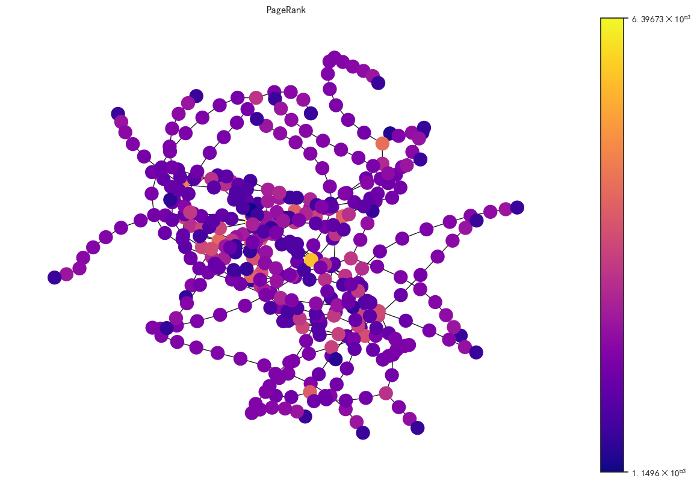
    


### 社群属性Clustering


#### 三角形个数


```python
# nx.triangles(G)
# dict_sort_by_value(nx.triangles(G))
```


```python
plt.figure(figsize=(10, 5))
draw(G, pos, nx.triangles(G), 'Triangels')
```

    Font 'default' does not have a glyph for '-' [U+2212], substituting with a dummy symbol.
    Font 'default' does not have a glyph for '-' [U+2212], substituting with a dummy symbol.
    Font 'default' does not have a glyph for '-' [U+2212], substituting with a dummy symbol.
    Font 'default' does not have a glyph for '-' [U+2212], substituting with a dummy symbol.
    Font 'default' does not have a glyph for '-' [U+2212], substituting with a dummy symbol.
    Font 'default' does not have a glyph for '-' [U+2212], substituting with a dummy symbol.
    Font 'default' does not have a glyph for '-' [U+2212], substituting with a dummy symbol.
    Font 'default' does not have a glyph for '-' [U+2212], substituting with a dummy symbol.


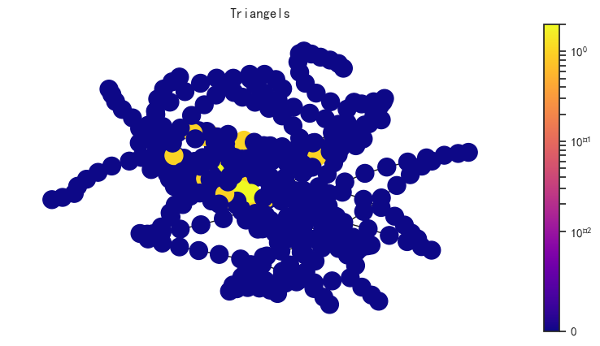
    


#### Clustering coefficients


```python
plt.figure(figsize=(10, 5))
draw(G, pos, nx.clustering(G), 'Clustering coefficients')
```

    Font 'default' does not have a glyph for '-' [U+2212], substituting with a dummy symbol.
    Font 'default' does not have a glyph for '-' [U+2212], substituting with a dummy symbol.
    Font 'default' does not have a glyph for '-' [U+2212], substituting with a dummy symbol.
    Font 'default' does not have a glyph for '-' [U+2212], substituting with a dummy symbol.
    Font 'default' does not have a glyph for '-' [U+2212], substituting with a dummy symbol.
    Font 'default' does not have a glyph for '-' [U+2212], substituting with a dummy symbol.
    Font 'default' does not have a glyph for '-' [U+2212], substituting with a dummy symbol.
    Font 'default' does not have a glyph for '-' [U+2212], substituting with a dummy symbol.


    


### 计算全图Graphlet个数


```python
import itertools
```


#### 导入全图


```python
G = nx.karate_club_graph()
```


```python
plt.figure(figsize=(10, 8))
pos = nx.spring_layout(G, seed=123)
nx.draw(G, pos, with_labels=True)
```


​    
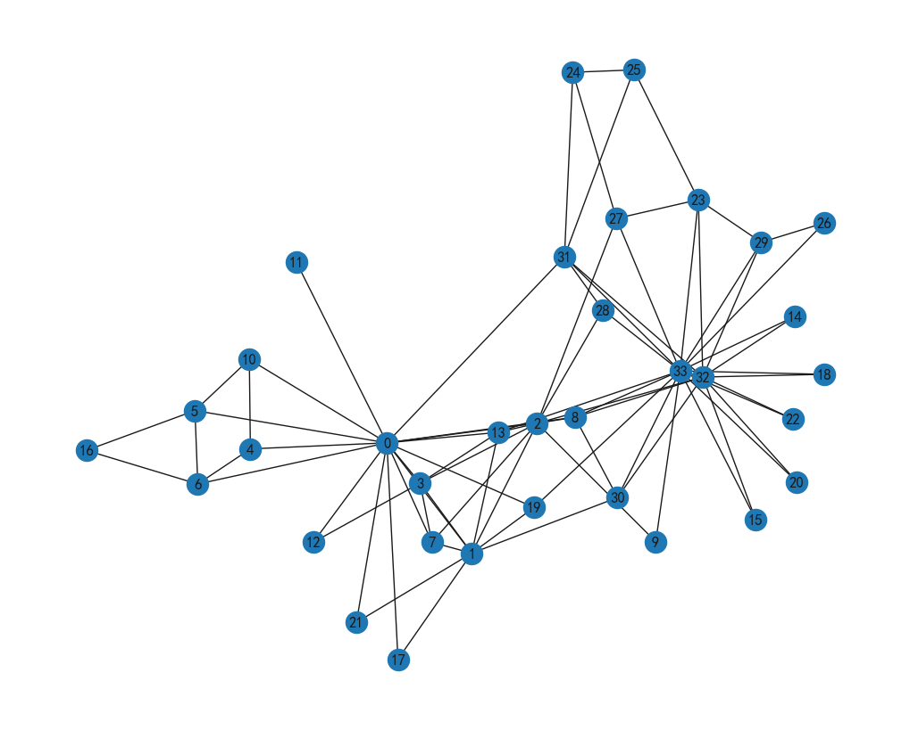
​    


#### 指定Graphlet


```python
target = nx.complete_graph(3)
nx.draw(target)
```


​    
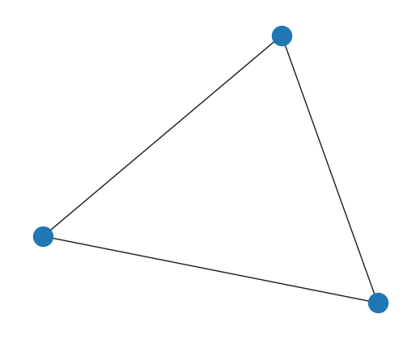
​    


#### 匹配Graphlet,统计个数


```python
num = 0
for sub_nodes in itertools.combinations(G.nodes(), len(target.nodes())): # 遍历全图中，符合graphlet结点个数的所有结点组合
    subg = G.subgraph(sub_nodes) # 从全图中抽取子图
    if nx.is_connected(subg) and nx.is_isomorphic(subg, target): # 如果子图是完整连通域 并且符合graphlet特征。输出原图结点编号
        num += 1
        print(subg.edges()) 
```

    [(0, 1), (0, 2), (1, 2)]
    [(0, 1), (0, 3), (1, 3)]
    [(0, 1), (0, 7), (1, 7)]
    [(0, 1), (0, 13), (1, 13)]
    [(0, 1), (0, 17), (1, 17)]
    [(0, 1), (0, 19), (1, 19)]
    [(0, 1), (0, 21), (1, 21)]
    [(0, 2), (0, 3), (2, 3)]
    [(0, 2), (0, 7), (2, 7)]
    [(0, 2), (0, 8), (8, 2)]
    [(0, 2), (0, 13), (2, 13)]
    [(0, 3), (0, 7), (3, 7)]
    [(0, 3), (0, 12), (3, 12)]
    [(0, 3), (0, 13), (3, 13)]
    [(0, 4), (0, 6), (4, 6)]
    [(0, 4), (0, 10), (10, 4)]
    [(0, 5), (0, 6), (5, 6)]
    [(0, 5), (0, 10), (10, 5)]
    [(1, 2), (1, 3), (2, 3)]
    [(1, 2), (1, 7), (2, 7)]
    [(1, 2), (1, 13), (2, 13)]
    [(1, 3), (1, 7), (3, 7)]
    [(1, 3), (1, 13), (3, 13)]
    [(2, 3), (2, 7), (3, 7)]
    [(2, 3), (2, 13), (3, 13)]
    [(8, 2), (8, 32), (2, 32)]
    [(16, 5), (16, 6), (5, 6)]
    [(8, 30), (8, 32), (32, 30)]
    [(8, 30), (8, 33), (33, 30)]
    [(8, 32), (8, 33), (33, 32)]
    [(32, 14), (32, 33), (33, 14)]
    [(32, 15), (32, 33), (33, 15)]
    [(32, 18), (32, 33), (33, 18)]
    [(32, 20), (32, 33), (33, 20)]
    [(32, 22), (32, 33), (33, 22)]
    [(33, 23), (33, 27), (27, 23)]
    [(32, 23), (32, 29), (29, 23)]
    [(33, 23), (33, 29), (29, 23)]
    [(32, 23), (32, 33), (33, 23)]
    [(24, 25), (24, 31), (25, 31)]
    [(33, 26), (33, 29), (26, 29)]
    [(33, 28), (33, 31), (28, 31)]
    [(32, 29), (32, 33), (33, 29)]
    [(32, 30), (32, 33), (33, 30)]
    [(32, 31), (32, 33), (33, 31)]


### 拉普拉斯矩阵特征值分解


#### 创建图


```python
n = 1000 # 结点个数
m = 5000 # 连接个数
G = nx.gnm_random_graph(n, m, seed=5040)
```


#### 邻接矩阵（Adjacency Matrix）


```python
A = nx.adjacency_matrix(G)
```


```python
A.shape
```


    (1000, 1000)


```python
A.todense()
```


    matrix([[0, 0, 0, ..., 0, 0, 0],
            [0, 0, 0, ..., 0, 0, 0],
            [0, 0, 0, ..., 0, 0, 0],
            ...,
            [0, 0, 0, ..., 0, 0, 0],
            [0, 0, 0, ..., 0, 0, 0],
            [0, 0, 0, ..., 0, 0, 0]], dtype=int32)


#### 拉普拉斯矩阵（Laplacian Matrix）
$$
L = D - A
$$
L 为拉普拉斯矩阵

D 为结点degree对角矩阵

A 为邻接矩阵


```python
L = nx.laplacian_matrix(G)
```


```python
L.shape
```


    (1000, 1000)


```python
# 结点degree对角矩阵
D = L + A
```


```python
D.todense()
```


    matrix([[12,  0,  0, ...,  0,  0,  0],
            [ 0,  6,  0, ...,  0,  0,  0],
            [ 0,  0,  8, ...,  0,  0,  0],
            ...,
            [ 0,  0,  0, ...,  8,  0,  0],
            [ 0,  0,  0, ...,  0,  6,  0],
            [ 0,  0,  0, ...,  0,  0,  7]], dtype=int32)


#### 归一化拉普拉斯矩阵（Normalized Laplacian Matrix）
$L_n = D^{-\frac{1}{2}}LD^{-\frac{1}{2}}$


```python
L_n = nx.normalized_laplacian_matrix(G)
```


```python
L_n.shape
```


    (1000, 1000)


```python
L_n.todense()
```


    matrix([[1., 0., 0., ..., 0., 0., 0.],
            [0., 1., 0., ..., 0., 0., 0.],
            [0., 0., 1., ..., 0., 0., 0.],
            ...,
            [0., 0., 0., ..., 1., 0., 0.],
            [0., 0., 0., ..., 0., 1., 0.],
            [0., 0., 0., ..., 0., 0., 1.]])


```python
plt.imshow(L_n.todense())
```


    <matplotlib.image.AxesImage at 0x13bddf8b130>


​    
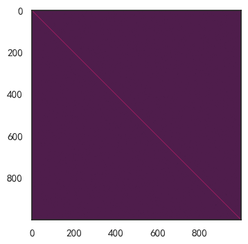
​    


#### 特征值分解


```python
e = np.linalg.eigvals(L_n.A)
```


```python
max(e)
```


    1.5924617911775976


#### 特征值分布直方图


```python
plt.figure(figsize=(12, 8))

plt.hist(e, bins=100)
plt.xlim(0, 2)

plt.title('Eigenvalue Histogram', fontsize=20)
plt.ylabel('Frequency', fontsize=25)
plt.xlabel('Eigenvalue', fontsize=25)
plt.tick_params(labelsize=20)
plt.show()
```


​    
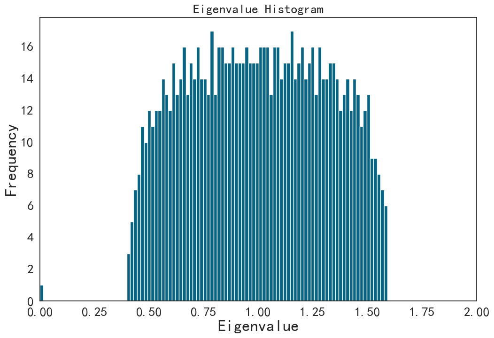
​    


